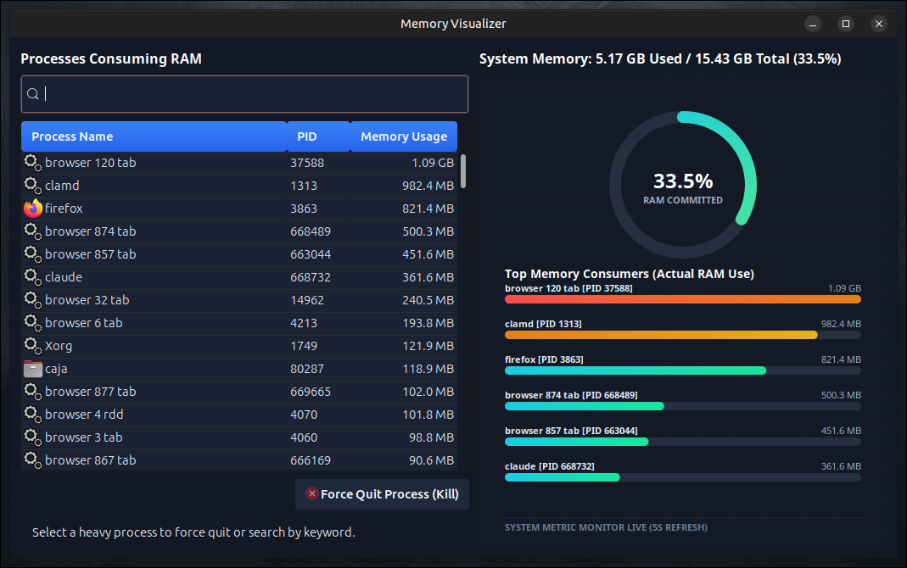

<div align="center">

<a href="https://github.com/effjy/ram/"></a>

A modern, high-performance **GTK3 + Cairo** RAM usage analyzer written in C. It lists your top memory-consuming processes, renders live memory stats with custom Cairo ring gauges and bar charts, and lets you safely terminate runaway RAM hogs — with verified kills, not fire-and-forget signals.


</div>

## Screenshot



## Features

- **Top RAM consumers** — a sortable list of processes (PID, icon, name, RAM in MB).
- **Live Cairo visuals** — a circular RAM ring gauge and horizontal bar charts, redrawn in real time.
- **Auto-refresh** — process list and stats update every 5 seconds.
- **Search filter** — quickly narrow the process list by name.
- **Verified process termination** — sends `SIGTERM`, confirms the process actually exits, and offers a forceful `SIGKILL` fallback for processes that ignore the polite request. A delivered signal is never assumed to be a successful kill.

## Prerequisites

You need a C compiler, `make`, `pkg-config`, and the GTK3 development headers.

### Debian / Ubuntu / Ubuntu MATE

```bash
sudo apt update
sudo apt install build-essential pkg-config libgtk-3-dev
```

### Fedora

```bash
sudo dnf install gcc make pkgconf-pkg-config gtk3-devel
```

### Arch Linux

```bash
sudo pacman -S base-devel gtk3
```

## Build

Clone the repository and compile:

```bash
git clone https://github.com/effjy/ram.git
cd ram
make
```

This produces the `ram-visualizer` binary in the current directory. You can run it directly without installing:

```bash
./ram-visualizer
```

## Install

To install system-wide (binary, icon, and desktop launcher):

```bash
sudo make install
```

After installation, search for **"Memory Visualizer"** in your application menu, or run `ram-visualizer` from a terminal.

To remove it:

```bash
sudo make uninstall
```

## Usage

1. Launch the app from your application menu or with `ram-visualizer`.
2. The left panel lists the top RAM-consuming processes; the right panel shows live Cairo gauges and charts. Both refresh automatically every 5 seconds.
3. Use the **search box** to filter the process list by name.
4. To stop a process:
   - Select it in the list and click **Force Quit Process (Kill)**.
   - Confirm the prompt. The app sends `SIGTERM` and verifies the process actually exits.
   - If the process ignores `SIGTERM`, you'll be offered a forceful `SIGKILL`.
   - A status message confirms success, or explains the failure (e.g. insufficient privileges). To kill processes you don't own, launch the app with elevated privileges.

## License

Released under the MIT License.
